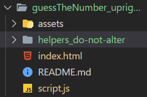

# Upright Unit 2 - Guess the Number Project

#### URL: [https://github.com/shawksly/Unit2-Guess-the-Number](https://github.com/shawksly/Unit2-Guess-the-Number)

## Status === Complete

## Languages

JavaScript, HTML, CSS

## Pseudocode
This website and code provides a user two games to play, one where they guess the computer's number, and another where the computer guesses their number.

#### Flow / Description
##### User guesses computer number
1. variable - functionCounter  = 0 - defined outside function to count how many times it's run
2. function - randomNumber (guess input from user, computer stored number)
    1. increment counter variable
    2. if:
        1. user guess is outside 1-100, return error
        2. user guess is the same as the computer number, return correct
        3. user guess is less than computer number, return try higher
        4. user guess is more than computer number, return try lower
##### Computer guesses user number
1. variables
    1. currentNumber - stores current computer guess
    2. lowest - stores lowest guess
    3. highest - stores highest guess
    4. guesses - stores amount of guesses
2. functions
    1. createGuess() - in charge of logic behind computer guesses
        1. sets currentNumber to a random number between the highest and lowest guesses -- starts with 1 and 100
        2. increments guesses variable
        3. returns currentNumber
    2. startCompGuess() - in charge of starting the guessing process from the beginning
        1. (re)sets lowest to 1, highest to 100, and guesses to 0
        2. calls createGuess().
        3. returns first guess and amount of guesses as string
    3. compGuess(reply) - in charge of responding to user button input -- taken in through reply parameter
        1. if:
            1. user says number is out of bounds, return error
        2. else:
            1. switch - cases from reply variable
                1. reply == lower
                    1. highest is set to currentNumber - 1 -- the minus 1 keeps the computer from repeating a number
                    2. returns new guess with createGuess() and guess count
                2. reply == higher
                    1. highest is set to currentNumber + 1 -- the plus 1 keeps the computer from repeating a number
                    2. returns new guess with createGuess() and guess count
                3. reply == correct
                    1. returns current number correct and guess count.


# **********************
# Original ReadMe Below
# **********************
# Guess The Number

Before starting to code this project, please find a partner and play this game together verbally for a few rounds.

1. Alice thinks of a number
2. Bob guesses a number
3. Alice says "higher", "lower", or "correct"
4. repeat 2 & 3 until Bob guesses correctly
5. repeat 1-4 with Alice guessing

After you get a feel for the game, it's time to write a software version of the game, where the *computer* thinks of a number between 1 and 100 and the *player* tries to guess it.

Think carefully about how the computer will guess a number. Start with it guessing a [random number](https://developer.mozilla.org/en-US/docs/Web/JavaScript/Reference/Global_Objects/Math/random) between 1 and 100. Once that's working, high five, take a break, then try to use a more efficient guessing algorithm instead.

> "Make it work, make it right, make it fast -- in that order." - Kent Beck

---

## Workspace
You will see the following folder structure:



Don't worry if the color of the files are not the same.

Within the ```index.html``` document, go ahead and run **Live Server** so that your default browser displays. This will be the interface that you will be testing within.

The only file that you will be working within to complete this project is within the ```script.js``` file. **Altering any other files can result in breaking this project.**

---

## Part 1: Guess the Computers Number

Upon start up, a random number has been generated by the program. You will need to build out the functionality to allow for the computer to respond with:
```
Lower
Higher
The number was [number]!
```

Within the browser, the player will guess a number within the input field. Depending on the guess, the function will need to **return a string** that responds accordingly.

### Stretch Goal
- Try adding something that details of how many guesses it took to get the right number. This could be a part of the original response.

--- 
## Part 2: The Computer Guesses Your Number

Now it's time to have the computer guess the users number!

The computer will have to guess a number between 1 and 100 after the **Start** button is selected. This will fire off the **startCompGuess** function. A number will be provided. *hint: console log the parameter to see what is being provided*

You will need to solve the issue of how to respond depending on the guess and the number the has thought of, the user will need to respond by clicking the "Lower", "Correct", or "Higher" buttons. 

When the users clicks those buttons, it should keep track of what is the lowest and highest values to guess between.

* Off-by-one errors will bite you here. Be clear in your own mind (and in the code!) about the distinction between "greater than" and "greater than or equal to" and the like.

* Sign reversal errors are also a strong possibility. Be clear about the distinction between "my guess is higher than your number" and "your number is higher than my guess" and so forth.

* When you feel like your game is mostly functional have a classmate play it.  See how they break it, and try to make your game more robust.

### Stretch Goals
- Add a condition that checks if it isn't possible to guess a number in any cases when a user changes their number to "trick" the computer.

## Hints

* Before writing real code in a text editor, try writing *pseudocode* or a *flowchart* on paper. That will help you to understand the essence of the algorithm without getting bogged down in syntax (like semicolons and parentheses).


## Backlog

* **Test!** How could you write unit tests for a game like this? Are there any parts of the algorithm that you can extract into a function, then write tests for just that function?

* **Test first!** Now that you've written it once, throw it away! Start over from scratch, but this time, use *test-driven development*: write a test, watch it fail, make it pass, repeat.

* **Additionals** Try tracking the number of guesses. Include that into the return.

## After Project

Feel free to review what may be happening in the helpers_do-not-alter folder. Warning: Changing anything in that folder could result in breaking the final view of the display. Adding comments, however, will not! 